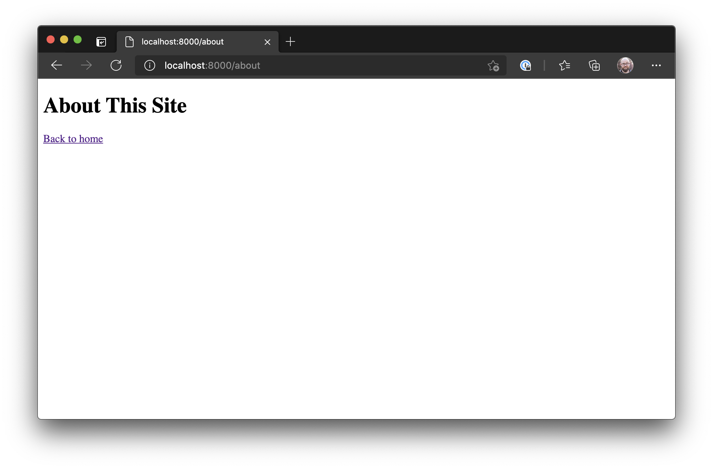

Next up, create a second page called `src/about.js` and add the following code:

```jsx
import * as React from "react";
import { Link } from "gatsby";

export default function AboutPage() {
  return (
    <main>
      <h1>About This Site</h1>
      <Link to="/">Back to home</Link>
    </main>
  );
}
```

Visit `http://localhost:8000/about/` and you should see the following:



Add a link to the about page from the home page by making the following changes:

```diff
  import * as React from 'react';
+ import { Link } from 'gatsby';

  export default function IndexPage() {
    return (
      <main>
        <h1>Hello Frontend Masters</h1>
+       <Link to="/about">About this site</Link>
      </main>
    );
  }
```
