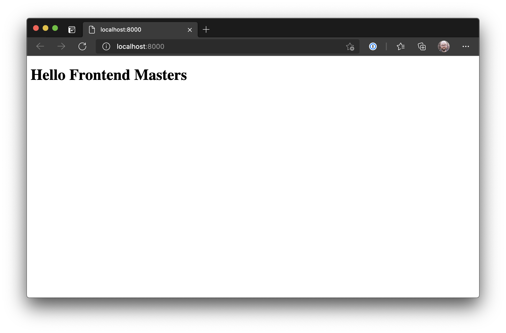

To start, let's remove the default page and create a simple page.

Open `src/pages/index.js` and replace its contents with the following:

```jsx
import * as React from "react";

export default function IndexPage() {
  return (
    <main>
      <h1>Hello Frontend Masters</h1>
    </main>
  );
}
```

Save the page, then start the project using Netlify Dev:

```bash
npm run develop
```

This will start the Gatsby site at `http://localhost:8000`. Any changes will be hot-reloaded.


