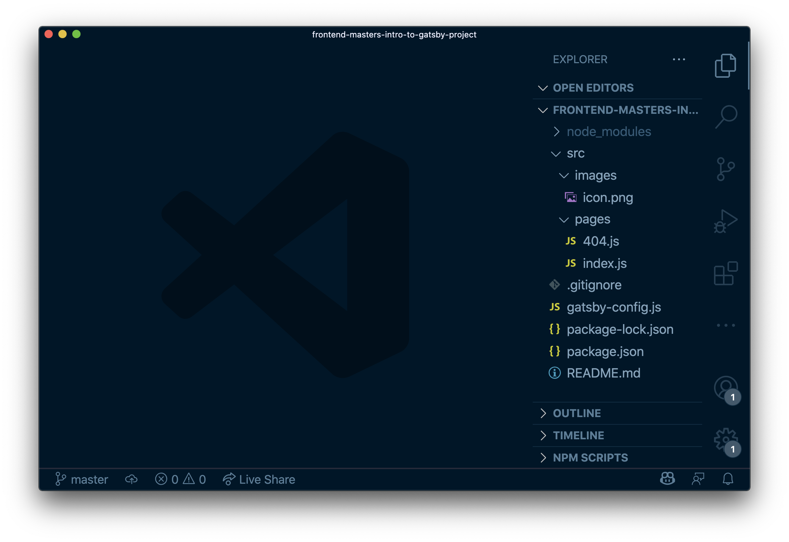

Before we start, make sure you're using the latest version of Node. Strictly speaking you need at least Node 12. The code in this course was written using Node 16.6.1.

```bash
# if you need it, install the latest version of Node
nvm install 16

# make sure you're using the latest version of Node
nvm use 16

# we'll be using the Netlify CLI, so install that if you don't have it
npm install -g netlify-cli
```

## Set up a new project

```bash
npm init gatsby
```

This command kicks off a CLI flow that helps you:

- name the project
- choose a folder
- choose additional options

For our project, we'll start fairly simple:

- Choose "no" for a CMS
- Choose "no" for a styling system
- Don't select any additional features or plugins

> Don't worry: we'll get into this a little bit later!

## Move into the new project and open it for editing

```bash
cd frontend-masters-intro-to-gatsby-project

# open with your favorite code editor
code .
```



Your new Gatsby site will look like this.
